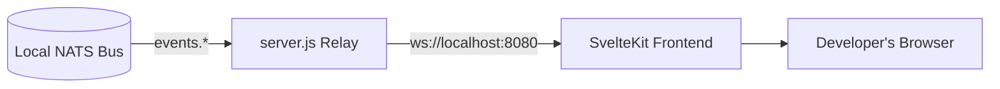

# Autonomic AI Web Dashboard (`agent-ui`)

A premium, visually stunning web application for deep observability and high-fidelity demos of the Autonomic AI ecosystem. 

Built using SvelteKit, Bun, and custom Vanilla CSS to strictly adhere to the Autonomic glassmorphism aesthetic.

## Features

- **Real-Time NATS Relay**: A lightweight Node.js/Bun script bridges the local TCP NATS bus to WebSockets.
- **Glassmorphism UI**: High-end dark mode layout with glowing micro-animations.
- **Interactive Panels**: Monitor `agent-heart` vitals, track `agent-spine` DAG execution, watch live `agent-muscle` sandbox logs, and see exactly what context `agent-brain` is injecting.

## Installation & Usage

### Via Autonomic CLI (Recommended)
You do not need to install Bun or run this locally to view your agents. The Autonomic CLI handles spinning up the local relay and opening the hosted UI:
```bash
autonomic ui
```
*(This starts the NATS-to-WebSocket relay on port 8080 and opens `ui.autonomic-ai.dev`, which connects back to your local relay).*

### Manual Local Dev
If you are modifying the dashboard UI:
```bash
git clone https://github.com/autonomic-ai-dev/agent-ui.git
cd agent-ui

# Install dependencies using Bun
bun install

# Start the NATS-to-WebSocket relay (Terminal 1)
bun run server.js

# Start the SvelteKit frontend (Terminal 2)
bun run dev
```

## Architecture


